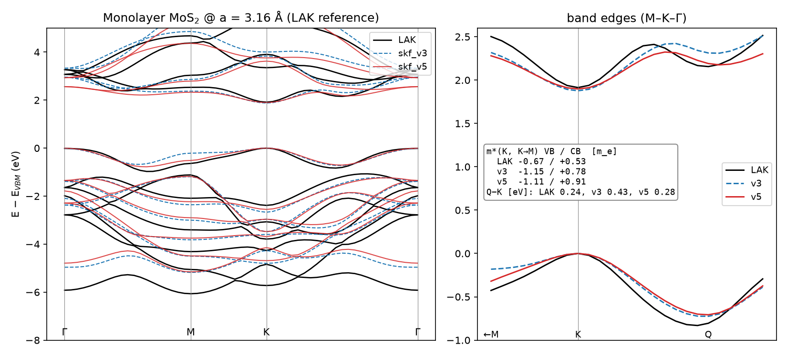
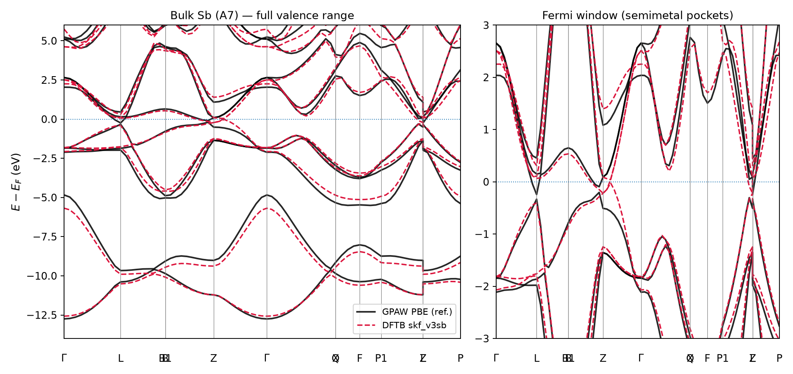
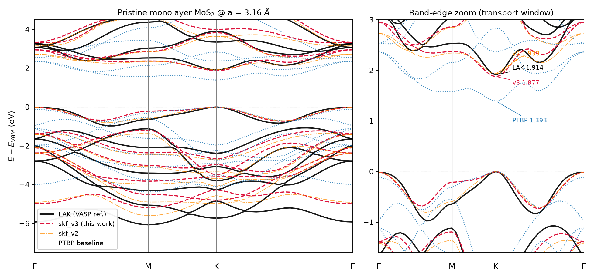
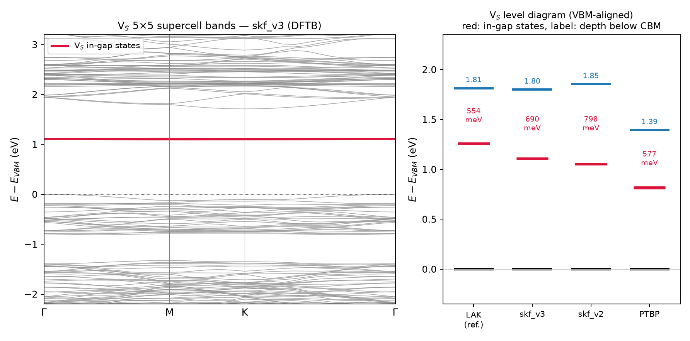

# mos2-dftb-params

DFTB (Slater–Koster) parameter sets for **monolayer MoS₂ with S-vacancy and O-substitution
defects**, built for NEGF quantum-transport calculations with
[DFTB+](https://dftbplus.org) (libNEGF), together with the full parameterization
pipeline used to generate them.

The electronic structure is fitted against the **LAK meta-GGA**
(Lebeda–Aschebrock–Kümmel, [PRL 133, 136402 (2024)](https://doi.org/10.1103/PhysRevLett.133.136402)),
which delivers near-HSE06 band gaps at semilocal cost — the reference calculations
were run with VASP 6.4.2 + libxc 7.1.2 (`METAGGA = LIBXC`, `LIBXC1 = MGGA_X_LAK`,
`LIBXC2 = MGGA_C_LAK`) at the experimental in-plane lattice constant a = 3.16 Å.

## Parameter sets (`skf/`)

| Set | Contents | Intended use |
|---|---|---|
| **`skf_v3`** | Electronic part, Mo & S — **multi-target optimum (bands + V_S defect level)** | **Recommended** for defect/transport studies on fixed geometries |
| **`skf_v4o`** | v3 Mo/S + **optimized O** (confinement + onsite fitted to sub_O spectrum) | **Recommended** for O-substitution studies |
| `skf_v3o` | v3 Mo/S + provisional O pairs | superseded by `skf_v4o` |
| `skf_v2` | Electronic part only, Mo & S (spd basis, band-only optimum) | Band structure / NEGF on fixed geometries (`PolynomialRepulsive = SetForAll { Yes }`) |
| **`skf_v3rep`** | v3 + CCS repulsive splines refit for v3 electronics | Relaxations / energetics (E(a) RMS 114 meV/cell) |
| `skf_v2rep` | v2 + CCS repulsive splines | superseded by `skf_v3rep` |
| `skf_v2o` | v2 + provisional O/H pairs (rule-of-thumb confinement) | O-substitution defect studies |

| **`skf_v3sb`** | **4-element contact set: Mo/S (v3) + O (v4o) + Sb (spd, PBE-fitted)** — all 16 pairs | **Sb/MoS₂ contact (semimetal electrode) transport** |
| **`skf_v5`** | **4-element set, generation 5: vacuum-level-aligned Mo/S/O/Sb, SOC-in-loop Sb, band-edge-curvature + Q-valley + 12×12-mesh targets** | **Recommended electronic set for MoS₂ / O_S / Sb-contact transport on fixed geometries** |
| **`skf_v5rep`** | v5 + CCS repulsion: Mo/S (rep-type, energies+forces; E(a) RMS 28 meV/cell, a_eq +0.09 %) and Sb–Sb / S–Sb (sw-type, PBE E(V) of bulk Sb and Sb₂S₃) | Relaxations of MoS₂ and Sb₂S₃ internal coordinates; bulk-Sb full relaxation only semi-quantitative (see docs) |

DFTB+ settings: `MaxAngularMomentum { Mo = "d"; S = "d"; O = "p"; Sb = "d"; H = "s" }`.

## Generation 5 (2026-09-02): alignment, curvature, SOC-in-loop — see `docs/session_20260902.md`

Diagnosis of v3/v3sb showed three method-level gaps: (i) the absolute onsite levels were
unconstrained (bulk-Sb E_F sat at −1.45 eV instead of ≈ −4.6 eV, i.e. 2 eV above the MoS₂ CBM),
(ii) band-edge effective masses were 50–70 % too heavy and the Q valley 0.19 eV too high, and
(iii) three parameters were pinned at their search bounds. v5 adds to the loss: vacuum-referenced
alignment targets (GPAW PBE: MoS₂ IP 5.94 / EA 4.21 eV, Sb(111) work function 4.19 eV), K-point
curvature and Q–K terms, the 12×12 IBZ mesh already contained in the LAK EIGENVAL, and for Sb the
SOC-included path bands, the full-BZ 16³ state-counting overlap and the slab E_F.

| Quantity | reference | v3 / v3sb | **v5** |
|---|---|---|---|
| K midgap rel. vacuum | −5.08 eV (PBE) | −4.41 | **−5.13** |
| Q–K valley splitting | 0.242 eV | 0.433 | **0.278** |
| m*(VB,K→M) / m*(CB,K→M) | −0.67 / 0.53 m_e | −1.15 / 0.78 | −1.11 / 0.91 (not improved) |
| V_S level below CBM | 0.554 eV | 0.690 | 0.736 (worse; trade-off with curvature) |
| O_S: O 2s level error / gap | — / 1.826 eV | 5 meV / 1.76 | 6 meV / 1.77 |
| E(a) RMS / a_eq error (repulsion) | — | 114 meV, +1.1 % | **28 meV, +0.09 %** |
| Sb: SOC path RMS (E_F ± 2 eV) | — | 0.327 eV | **0.286** |
| Sb: band overlap (16³ mesh, SOC) | +244 meV | +117 | **+222** |
| Sb(111) slab E_F | −4.19 eV (PBE) | −1.83 | **−4.15** |
| Sb₂S₃ (unfitted check): gap / VB RMS | 1.29 eV (PBE) | — | 1.57 / 0.12 eV |
| Sb(111)/MoS₂ 4×4 interface: E_F − CBM | — | meaningless | +0.01 eV (barrier-free n-contact) |

SOC block for v5: `Mo [eV] = {0.0 0.036 0.0953}; S = {0.0 0.055 0.0}; O = {0.0 0.02 0.0}; Sb = {0.0 0.571 0.0}`
(Mo 4d from the 150 meV K-splitting, Sb 5p from the Γ-point multiplet span).

Known limitations of v5: masses and the V_S depth did not improve (a mass-weighted variant is being
explored as `optm3`); the Sb alignment uses the PBE work function (experiment is ~0.4 eV larger — a
single common shift of the Sb onsites in `Sb-Sb.skf` moves it); the sw-type Sb repulsion reproduces the
E(V) scans (23–35 meV/cell) but underestimates the Peierls distortion in a full bulk-Sb relaxation
(rhombohedral angle 59.7° vs 57.1°), so keep DFT geometries for the Sb electrode; no Mo–Sb repulsion.



## Antimony (semimetal contact electrode)

Sb is a leading contact metal for MoS₂ (semimetal electrodes à la Bi/Sb give
ultralow contact resistance). Since Sb is a **semimetal, a PBE reference is
physically sufficient** (no band-gap-underestimation issue), so the entire Sb
parameterization was done locally: GPAW PBE reference for bulk Sb (A7,
experimental structure) → hotcent spd basis (5s5p + 5d polarization,
scalar-relativistic) → 8-parameter optuna fit with Fermi-window weighting.

Accuracy vs. GPAW PBE (bulk A7 Sb, Fermi-aligned): **RMS 0.165 eV within
E_F ± 2 eV** (0.22 eV over the full 5s5p valence + conduction window).

**Semimetallicity check** (full-BZ 16³ state-counting, `scripts/sb/sb_semimetal_check.py`):
Sb is an *indirect-overlap* semimetal — every k-point has a direct gap
(min 89 meV in PBE+SOC), so band-path plots look "gapped"; the overlap lives
between the H-point hole pocket and the L-point electron pocket.

| | GPAW PBE+SOC | DFTB skf_v3sb+SOC |
|---|---|---|
| band overlap | +244 meV (expt ~ +180) | +117 meV |
| hole pocket | H point | symmetry-equivalent H point |
| pocket size | ~0.3 % of BZ | ~0.4 % of BZ |

The semimetal character (sign, pocket locations, tiny pockets) is reproduced;
the overlap magnitude is ~half of the reference — consistent with the 0.165 eV
band residual. Adding the overlap as an explicit fit target is the natural next
refinement if carrier densities matter. Sb SOC (ξ_5p ≈ 0.6 eV) is *not* yet calibrated
— add it via the same procedure as `soc/` before spin-resolved contact studies.



## Accuracy (vs. LAK reference @ a = 3.16 Å, monolayer)

| Quantity | `skf_v3` | `skf_v2` | LAK reference |
|---|---|---|---|
| K–K direct gap | 1.877 eV | 1.933 eV | 1.914 eV |
| Nature of gap | direct at K (K−Γ = +14 meV) | direct (+19 meV) | direct (+15 meV) |
| Q–K conduction-valley splitting | — | 221 meV | 242 meV |
| Weighted VB / CB RMS (Γ-M-K-Γ) | 0.33 / 0.29 eV | 0.28 / 0.29 eV | — |
| V_S in-gap level (5×5 cell) | **CBM − 0.69 eV** | CBM − 0.80 eV | CBM − 0.55 eV |
| O_S in-gap level (`skf_v4o`) | **none**, gap 1.76 eV | none (v2o), gap 1.82 eV | none, gap 1.83 eV |
| O 2s deep level in sub_O (`skf_v4o`) | VBM − 20.12 eV (err 5 meV) | — | VBM − 20.12 eV |
| sub_O VB spectrum RMS (`skf_v4o`) | 0.40 eV (0.2p-driven; was 1.72 provisional) | — | — |


*Pristine monolayer bands: LAK vs skf_v3 vs skf_v2 vs PTBP (right: band-edge zoom).*


*Left: folded bands of the V_S 5×5 supercell with `skf_v3` (red: flat in-gap states).
Right: VBM-aligned level diagram across potentials — note that PTBP's seemingly
reasonable depth sits inside a gap that is 0.4 eV too small.*

For comparison, the general-purpose PTBP baseline set gives a 1.39 eV gap on the
same footing (≈12× larger combined band loss).

Known limitations (work in progress):
- `skf_v3` (600-trial multi-target fit) reduces the V_S level error from 0.24 to
  0.14 eV at a modest band-quality cost; further improvement likely requires new
  physics (Hubbard-U scaling, onsite corrections) rather than more trials.
- O pairs are now optimized (`skf_v4o`): O 2s level matched to 5 meV, sub_O VB
  spectrum RMS 1.72 -> 0.40 eV, gap-state-free character preserved. H pairs
  remain provisional.
- **Spin-orbit coupling: calibrated constants available in `soc/`** —
  K-point VB splitting 150.2 meV (= LAK+SOC reference); the unfitted CB
  splitting (2.8 meV) matches the reference independently.

## Pipeline overview

```
VASP + libxc (LAK reference)          hotcent (PBE, scalar-rel.)        DFTB+
  bands @ a=3.16 (57-k path)  ──►  confinement/onsite optimization ──►  bands
  E(a), thickness scan, S2 curve      (optuna TPE, 16 parameters)        defect levels
  defect supercells (V_S, O_S)   ──►  CCS repulsive fit (ccs_fit)   ──►  transport-ready SKF
```

- `scripts/param/` — SK-table generation (`gen_skf.py`), band/loss evaluation
  (`compare_bands.py`, `dftb_bands.py`), optuna driver (`optimize_confinement.py`),
  repulsion fit (`run_ccs_fit.py`, `attach_and_validate.sh`), defect-level analysis.
- `scripts/vasp/` — LAK reference workflows (band path with zero-weight k-points,
  E(a) scans, defect supercells, SOC, snapshot generation).
- `scripts/setup/` — environment bootstrap used on the compute server
  (libxc with `DISABLE_FHC`, pylibxc, GPU build notes).
- `multi_target/optimize_multi.py` — band + V_S-level simultaneous fit
  (runs locally; ~19 s/trial on an M4 Max).
- `reference/` — LAK band reference (`bands_lak.json`), V_S level target,
  free-atom onsite/Hubbard values, CCS spline parameters.
- `docs/` — project log, final status notes (Japanese), band-structure figures.

Key methodological choices (see `docs/final_status_20260901.md` for details):
- Fit at the **experimental lattice constant** — at the LAK equilibrium (3.22 Å) the
  monolayer becomes indirect-gap, which would corrupt K-valley transport.
- **S needs an spd basis**; with sp only, the Γ-point VBM (S-pz) rises above K.
- Loss function includes direct-gap and Γ/K VBM-ordering penalties plus
  band-edge-weighted k-points (K valley ×3, Q valley ×2).

## Requirements

- [hotcent](https://gitlab.com/mvdb/hotcent) ≥ 2.0.1 + pylibxc (libxc ≥ 5; PBE electronic part)
- [DFTB+](https://github.com/dftbplus/dftbplus) ≥ 24.1 (25.1 used; note
  `CalculateForces` → `PrintForces` rename in ParserVersion 14)
- [CCS / ccs_fit](https://github.com/Teoroo-CMC/CCS) 0.22.x (needs numpy < 1.23 — use a
  separate venv)
- optuna, ASE, numpy/scipy
- For regenerating references: VASP ≥ 6.3 compiled with `-DUSELIBXC` against
  libxc ≥ 7.1.0 built with `--disable-fhc` / `-DDISABLE_FHC=ON` (LAK correlation
  requires libxc ≥ 7.1.0). POTCARs are **not** redistributed here.

## Citing the underlying methods

LAK: Lebeda, Aschebrock, Kümmel, PRL 133, 136402 (2024) ・ hotcent:
Van den Bossche, JCTC 20, 2538 (2024) ・ CCS: Kandy et al., JCTC 17 (2021) ・
DFTB+: Hourahine et al., JPCA 129, 5373 (2025) ・ PTBP baseline:
Cui, Reuter, Margraf, JCTC 20, 5276 (2024).

## Status / license

Research in progress (2026-09). License: TBD — contact the author before reuse.
